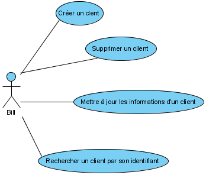

# Expression des besoins
La société américaine YAPS vend des animaux de compagnie. Elle est implantée depuis plusieurs décennies dans le sud de la Californie, où ses principaux clients sont domiciliés. Récemment elle a ouvert son marché à d'autres états américains, ainsi qu'à l'étranger. Elle continue à exercer sa profession telle qu'elle le faisait à ses débuts, c'est-à-dire qu'elle répertorie ses clients sur des fiches de papier bristol, indexées par le nom de famille, reçoit les commandes par fax et les chèques par courrier. Une fois le montant du chèque encaissé, YAPS envoie les animaux via la société de transport PetEx. Annuellement YAPS envoie son catalogue d'animaux domestiques à ses clients. Elle trouve ses nouveaux clients au travers de publicités qu'elle envoie aussi par courrier.

YAPS veut informatiser la gestion de ses clients car ils sont de plus en plus nombreux. Elle voudrait saisir leurs coordonnées et pouvoir les modifier. Cette informatisation lui permettrait surtout de pouvoir retrouver les informations de ses clients plus rapidement. YAPS possède des PC un peu obsolètes avec Windows comme système d'exploitation. Il faut donc que l'application ne consomme pas trop de ressources systèmes.

Cette tache de gestion des clients sera menée par Bill qui assure la relation clientèle. L'application devra être uniquement déployée sur le serveur d'impression. La particularité de ce serveur est qu'il est constamment allumé et n'est jamais éteint. YAPS ne possédant pas de base de données, les données peuvent être stockées en mémoire. L'application devra être simple d'utilisation et l'interface utilisateur, ainsi que la documentation et le code, devront être rédigés en anglais. Ce système de gestion clientèle se nomme PetStore Customer.

# Vue Utilisateur
## Diagramme de cas d'utilisation
Le diagramme de cas d'utilisation ci-dessous décrit les besoins utilisateurs de façon synthétique sous forme graphique. On comprend ainsi rapidement que l'utilisateur Bill veut pouvoir créer un, supprimer, modifier et rechercher un client.

### [Cas d'utilisation « Créer un client »](UC/creerClient)